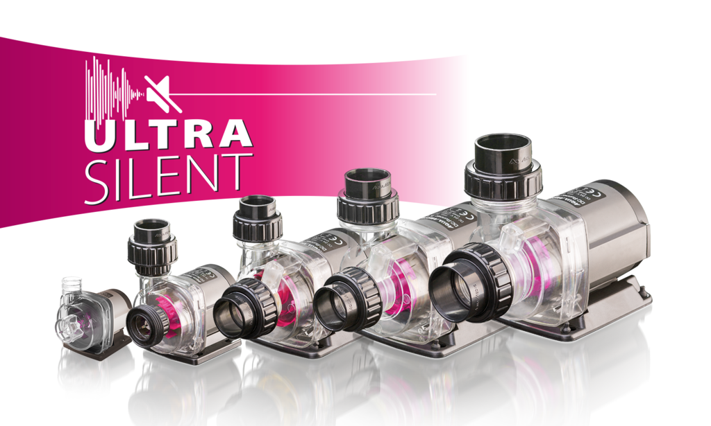
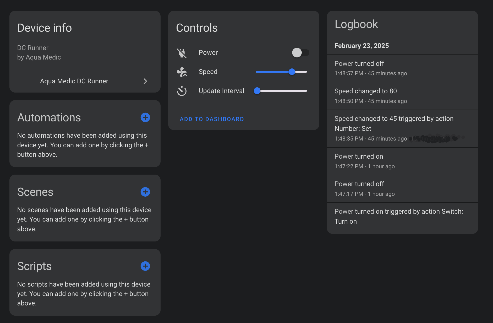

# Aqua Medic DC Runner Integration for Home Assistant

[](https://github.com/custom-components/hacs)
[](https://github.com/maziggy/aqua_medic_dc_runner/releases)
[](LICENSE)

A Home Assistant custom integration for controlling Aqua Medic DC Runner pumps through their cloud API.



## Features

- **Power Control**: Turn your pump on/off remotely
- **Speed Control**: Adjust motor speed (30-100%)
- **Real-time Monitoring**: Live status updates from your device
- **Update Interval Control**: Customize how often data is fetched
- **Cloud API Integration**: Uses Aqua Medic's official Gizwits cloud service

## Supported Devices

- Aqua Medic DC Runner x.3 series pumps
- Any Aqua Medic pump using the Gizwits cloud platform

## Prerequisites

- Home Assistant 2023.1 or newer
- Aqua Medic mobile app installed and working
- Network capture capability (for credential extraction)

## Installation

### HACS Installation (Recommended)

1. Open HACS in your Home Assistant
2. Go to "Integrations"
3. Click the three dots in the top right corner
4. Select "Custom repositories"
5. Add this repository URL: `https://github.com/maziggy/aqua_medic_dc_runner`
6. Select "Integration" as the category
7. Click "Add"
8. Search for "Aqua Medic DC Runner" and install

Or use this button:

[](https://my.home-assistant.io/redirect/hacs_repository/?owner=maziggy&repository=aqua_medic_dc_runner&category=integration)

### Manual Installation

1. Download the latest release from the [releases page](https://github.com/maziggy/aqua_medic_dc_runner/releases)
2. Extract the files to your `custom_components` directory:
   ```
   config/
   └── custom_components/
       └── aqua_medic_dc_runner/
           ├── __init__.py
           ├── client.py
           ├── config_flow.py
           ├── const.py
           ├── manifest.json
           ├── number.py
           ├── switch.py
           ├── extract_api_data.sh
           └── translations/
               └── en.json
   ```
3. Restart Home Assistant

## Setup & Configuration

### Step 1: Extract API Credentials

Since Aqua Medic migrated their user accounts to a new API version that doesn't support direct username/password authentication, you need to extract credentials from the mobile app.

#### Using the Extraction Script (macOS/Linux)

1. Copy the extraction script to your computer:
   ```bash
   # Download the script from the integration folder
   cp config/custom_components/aqua_medic_dc_runner/extract_api_data.sh ./
   chmod +x extract_api_data.sh
   ```

2. Run the extraction script:
   ```bash
   ./extract_api_data.sh
   ```

3. Follow the on-screen instructions:
   - The script will start capturing network traffic
   - Open the Aqua Medic app on your phone/tablet
   - Log in if needed
   - Turn your pump ON and OFF at least once
   - Change the pump speed at least once
   - Press ENTER when done

4. The script will output your credentials:
   ```
   🔍 EXTRACTED API DATA:
   =====================
   App ID:       07452c4f036a4be3acedf8dbeef38320
   User Token:   [your-token]
   Device ID:    [your-device-id]
   ```

#### Manual Extraction (Advanced Users)

If you prefer to extract credentials manually:

1. Use a network monitoring tool (Wireshark, tcpdump, etc.)
2. Capture traffic while using the Aqua Medic app
3. Look for HTTP requests to `euapi.gizwits.com`
4. Extract these values from the headers:
   - `X-Gizwits-Application-Id`: Your App ID
   - `X-Gizwits-User-token`: Your User Token
5. From the API calls, extract your Device ID from URLs like `/app/control/{device_id}`

### Step 2: Add Integration to Home Assistant

1. Go to **Settings** → **Devices & Services** → **Integrations**
2. Click **+ ADD INTEGRATION**
3. Search for "Aqua Medic DC Runner"
4. Enter your extracted credentials:
   - **Token**: Your user token from the extraction
   - **Device ID**: Your device ID from the extraction



### Step 3: Configure Entities

After successful setup, you'll have three entities:

#### 1. Power Switch
- **Entity ID**: `switch.aqua_medic_dc_runner_{device_id}_power`
- **Function**: Turn pump on/off
- **Icon**: Power plug (changes based on state)

#### 2. Speed Control
- **Entity ID**: `number.aqua_medic_dc_runner_{device_id}_speed`
- **Function**: Control motor speed
- **Range**: 30-100%
- **Icon**: Fan with chevron

#### 3. Update Interval
- **Entity ID**: `number.aqua_medic_dc_runner_{device_id}_update_interval`
- **Function**: Control how often data is fetched
- **Range**: 5-300 seconds
- **Default**: 30 seconds

## Usage

### Basic Control

Turn your pump on/off using the switch entity in your dashboard or automations:

```yaml
# Turn pump on
service: switch.turn_on
target:
  entity_id: switch.aqua_medic_dc_runner_glt7gwz2jtxjo7qcy3sjqb_power

# Turn pump off
service: switch.turn_off
target:
  entity_id: switch.aqua_medic_dc_runner_glt7gwz2jtxjo7qcy3sjqb_power
```

### Speed Control

Adjust pump speed:

```yaml
# Set speed to 75%
service: number.set_value
target:
  entity_id: number.aqua_medic_dc_runner_glt7gwz2jtxjo7qcy3sjqb_speed
data:
  value: 75
```

### Automations

Example automation to run pump at different speeds during day/night:

```yaml
automation:
  - alias: "Pump Day/Night Schedule"
    trigger:
      - platform: time
        at: "08:00:00"
        id: "morning"
      - platform: time
        at: "22:00:00"
        id: "evening"
    action:
      - choose:
          - conditions:
              - condition: trigger
                id: "morning"
            sequence:
              - service: switch.turn_on
                target:
                  entity_id: switch.aqua_medic_dc_runner_glt7gwz2jtxjo7qcy3sjqb_power
              - service: number.set_value
                target:
                  entity_id: number.aqua_medic_dc_runner_glt7gwz2jtxjo7qcy3sjqb_speed
                data:
                  value: 80
          - conditions:
              - condition: trigger
                id: "evening"
            sequence:
              - service: number.set_value
                target:
                  entity_id: number.aqua_medic_dc_runner_glt7gwz2jtxjo7qcy3sjqb_speed
                data:
                  value: 50
```

## Troubleshooting

### Common Issues

#### 1. Authentication Failed
- **Cause**: Token has expired or is invalid
- **Solution**: Re-extract credentials using the script

#### 2. Connection Failed
- **Cause**: Network issues or API downtime
- **Solution**: Check internet connection, verify API endpoints are accessible

#### 3. No Response from Device
- **Cause**: Device offline or not connected to app
- **Solution**: Ensure device is connected and responsive in the mobile app

#### 4. Entities Not Updating
- **Cause**: Update interval too high or API rate limiting
- **Solution**: Adjust update interval, check logs for errors

### Debug Logging

Enable debug logging to troubleshoot issues:

```yaml
logger:
  default: warning
  logs:
    custom_components.aqua_medic_dc_runner: debug
```

### API Testing

Test your credentials manually:

```bash
# Test device status
curl -X GET "http://euapi.gizwits.com/app/devdata/{device_id}/latest" \
  -H "X-Gizwits-Application-Id: {app_id}" \
  -H "X-Gizwits-User-token: {token}"

# Test power control
curl -X POST "http://euapi.gizwits.com/app/control/{device_id}" \
  -H "X-Gizwits-Application-Id: {app_id}" \
  -H "X-Gizwits-User-token: {token}" \
  -H "Content-Type: application/json" \
  -d '{"attrs": {"SwitchON": 1}}'
```

## API Information

This integration uses the Gizwits IoT platform API:

- **Base URL**: `http://euapi.gizwits.com`
- **Authentication**: Token-based (extracted from mobile app)
- **Protocol**: HTTP REST API
- **Rate Limiting**: Respect API limits, default 30-second intervals

### Key Endpoints

- **Device Status**: `GET /app/devdata/{device_id}/latest`
- **Device Control**: `POST /app/control/{device_id}`
- **Device Provisioning**: `POST /app/provision`

## Contributing

Contributions are welcome! Please:

1. Fork the repository
2. Create a feature branch
3. Make your changes
4. Add tests if applicable
5. Submit a pull request

## License

This project is licensed under the MIT License - see the [LICENSE](LICENSE) file for details.

## Disclaimer

This integration is not affiliated with Aqua Medic. Use at your own risk. The integration accesses Aqua Medic's cloud API, which may change without notice.

## Support

- **Issues**: [GitHub Issues](https://github.com/maziggy/aqua_medic_dc_runner/issues)
- **Home Assistant Community**: [Community Forum](https://community.home-assistant.io/)
